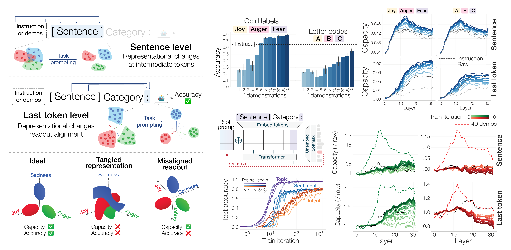

# The Geometry of Prompting: Unveiling Distinct Mechanisms of Task Adaptation in Language Models

This repository contains the code and data for the paper ["The Geometry of Prompting: Unveiling Distinct Mechanisms of Task Adaptation in Language Models"](https://arxiv.org/abs/2502.08009)

## Repo Structure

- `datasets` : Scripts to create processed datasets and pickle files for the datasets used in the paper.
- `experiments` : Sscripts to run the experiments and generate the results.
    - `run_ICL.py` : Runs the in-context learning on a specified dataset and model, extracts token embeddings and saves them to a pickle file on disk.
    - `run_prompt_tuning.py` : Runs the prompt tuning on a specified dataset and model, extracts token embeddings across training iterations and saves them to a pickle file on disk.
    - `compute_capacity.py` : Computes manifold capacity and other metrics for the token embeddings extracted from the in-context learning and prompt tuning runs.
    - `prompt_tuning_analysis.ipynb` : Jupyter notebook to visualize the results of the prompt tuning runs.
    - `stability_analysis.ipynb` : Jupyter notebook to create Figure 6 in the paper
- `plots` : Scripts to load results across runs and create the plots for the paper.
- `src` : Main source code for the project package (`LLM_Geometry`), which should be installed in the environment. This includes the model wrappers, data loaders, and other utilities.

